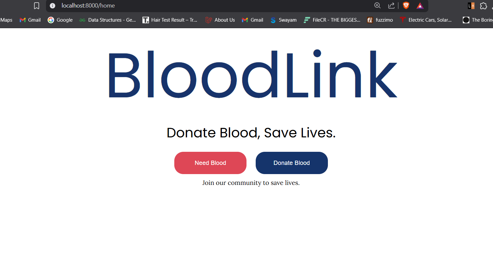
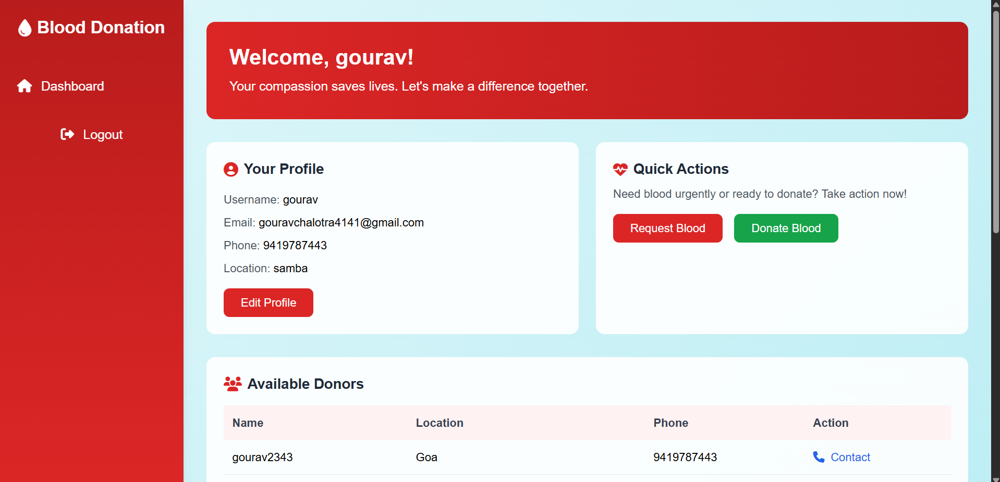
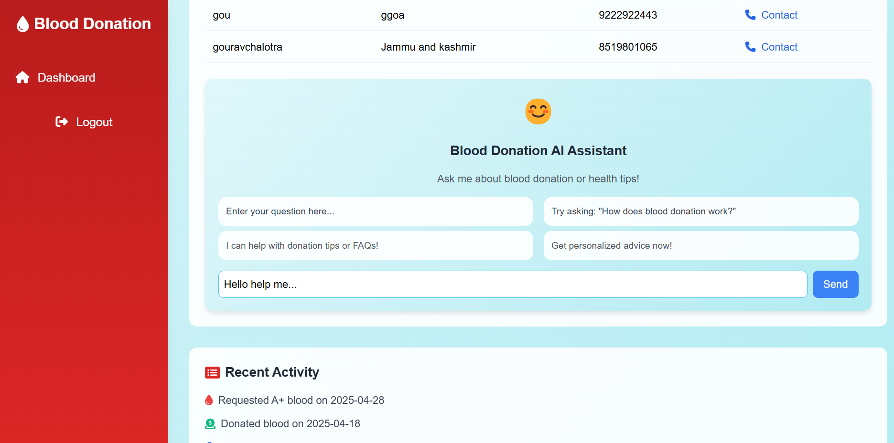

# BloodLink - Laravel Project Setup Guide

<p align="center">
    <a href="https://laravel.com" target="_blank">
        
    </a>
</p>

---

## 📥 Step 1: Clone the Repository

```bash
git clone https://github.com/<your-username>/BloodLink.git
```

Move into the project directory:

```bash
cd BloodLink
```

---

## 🛠️ Step 2: Install Dependencies

Install PHP and Composer dependencies:

```bash
composer install
```


---

## 🛠️ Step 3: Environment Setup

Copy the `.env.example` file to `.env`:

```bash
cp .env.example .env
```

Generate the application key:

```bash
php artisan key:generate
```

---

## 🛢️ Step 4: Database Setup

1. Create a new database in your local MySQL (example name: `bloodlink`).
2. Open `.env` file and update these lines according to your database configuration:

```env
DB_CONNECTION=mysql
DB_HOST=127.0.0.1
DB_PORT=3306
DB_DATABASE=bloodlink
DB_USERNAME=root
DB_PASSWORD=
```

Run database migrations:

```bash
php artisan migrate
```

---


---

## 🌍 Step 5: API Key Setup

Go to:

```plaintext
resources/views/Needblood/user_home.blade.php
```

Find this fetch request:

```javascript
try {
    const response = await fetch('https://generativelanguage.googleapis.com/v1beta/models/gemini-2.0-flash:generateContent?key=APIKEY', {
        method: 'POST',
        headers: {
            'Content-Type': 'application/json',
        },
        body: JSON.stringify({
            contents: [{
                parts: [{
                    text: Rules + prompt
                }]
            }]
        })
    });
```

> **Important:** Replace `APIKEY` with your own **Gemini 2.0 Flash API Key**.

### How to get the API Key:

- Visit: [Google AI Studio API Key](https://aistudio.google.com/apikey)
- Generate a key for **gemini-2.0-flash**.
- Replace `APIKEY` in the `fetch` URL.

Example:

```javascript
'https://generativelanguage.googleapis.com/v1beta/models/gemini-2.0-flash:generateContent?key=YOUR_ACTUAL_API_KEY'
```

---


## 🚀 Step 6: Run the Server

Start the local development server:

```bash
php artisan serve
```

> The project will be available at:  
> `http://localhost:8000`


# 📚 Summary of Commands

```bash
git clone https://github.com/gourav-chalotra/BloodLink.git
cd BloodLink
composer install
npm install
cp .env.example .env
php artisan key:generate
php artisan migrate
npm run dev
php artisan serve
```

---

# ✨ Additional Notes

- If any migration fails, make sure your database credentials are correct and database exists.
- If you make changes in front-end (CSS/JS), remember to run:

# Screen Shorts






